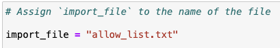
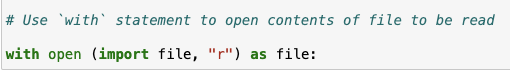
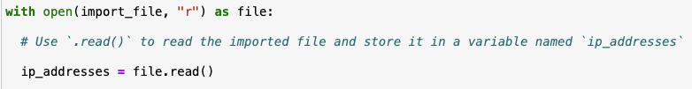
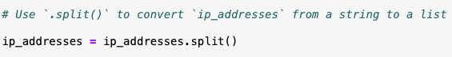
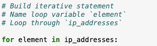
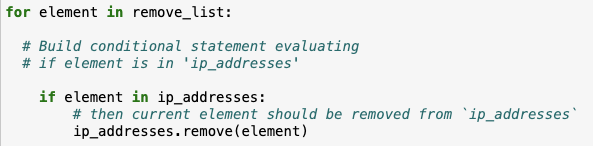
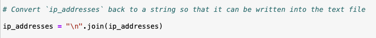
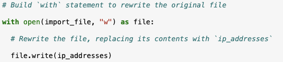

# Python Algorithm for File Updates

## 📌 Project Description

As a security professional working on a cybersecurity lab scenario, I developed a Python algorithm to automate the process of updating a file containing IP addresses authorized to access restricted patient data. The algorithm removes IP addresses listed in a separate **remove list** from the `allow_list.txt` file, ensuring only authorized users maintain access to sensitive systems.

---

## 🗂️ Open the File That Contains the Allow List

I assigned the filename `allow_list.txt` to the variable `import_file`. Then, using a `with` statement combined with the `open()` function in read mode (`"r"`), I opened the file safely for reading. The `with` statement ensures the file closes automatically after reading.

---

## 📖 Read the File Contents

I used the `.read()` method to load the entire content of the allow list file into a string variable `ip_addresses`.

---

## 🔁 Convert the String Into a List

Next, I converted the string of IP addresses into a list using the `.split()` method. This splits the string by whitespace into individual IP addresses for easier manipulation.

---

## 🔄 Iterate Through the Remove List

Iterating through IP addresses listed in the `remove_list` was achieved through a `for` loop. This loop iterated over the sequence of IP addresses and applied specific operations.

---

## ❌ Remove IP Addresses That Are on the Remove List

Inside the loop, I checked if the IP was present in the `ip_addresses` list and removed it using `.remove()` if found.

---

## 💾 Update the File With the Revised List of IP Addresses

To finalize the algorithm, the list had to be converted back into a string using the `.join()` method with `"\n"` as the separator. This string was then written back to the file using the `write()` method in `"w"` (write) mode.

---

## ✅ Final Result

The script successfully updates the `allow_list.txt` by removing any IPs found in the `remove_list`. This ensures only authorized users retain access to restricted data.

---

## 📎 Summary

This Python algorithm automates the update of an IP allow list by:

- Reading from a file
- Converting the contents to a list
- Removing specified IPs
- Writing the updated list back to the file

It ensures secure access control by maintaining a clean list of authorized IP addresses.

---

## 👨‍💻 Author

**Paras K C**  
[LinkedIn Profile](https://www.linkedin.com/in/paras-kc)

---

## 🧠 Topics Covered

- Python File I/O
- List manipulation
- String methods
- Cybersecurity automation (Lab scenario)

